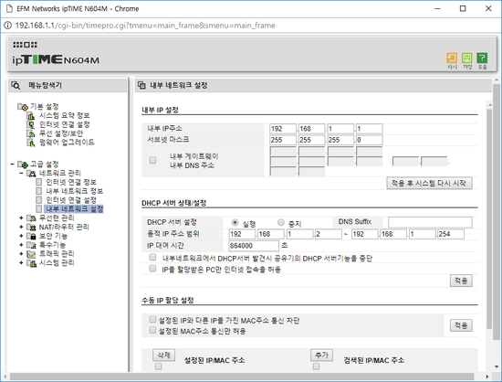

# home-router

## 인터넷 공유기, 소형 라우터와 ip

### 용어

```text
공인 IP, Public IP, 공개 IP, 외부 IP
사설 IP, Private IP, 내부 IP
Twin IP - 특정 컴퓨터에 공인 ip를 할당하는 공유기의 기능, 혹은 모든 포트가 열려있다고 가정
```

IP란 네트워크에서 컴퓨터들이 서로 통신하기 위한 점으로 구분된 4개의 번호를 뜻한다.

127.0.0.1 은 자기 자신 컴퓨터의 ip주소를 뜻한다.

hosts 설정을 보면 기본적으로 localhost라는 도메인이 127.0.0.1에 바인딩되어있다.

그래서 개발서버를 돌리면

```text
127.0.0.1:포트
localhost:포트
```

둘 중에 하나로 접근하면 된다.

도메인이 달라서 CORS에러가 난다면,

hosts파일을 수정해서 127.0.0.1을 CORS에러나는 도메인으로 설정하면 해결가능.

~~하지만 실제로 그 도메인에서 라이브가 돌아간다면 라이브에는 접속못하는 한계가\(...\)~~

## 가정용 공유기

우선, 공유기는 이름처럼 인터넷 선하나를 가지고, 여러개의 디바이스에서

인터넷을 접속할 수 있도록 도와줍니다. \(신호를 적절히 분리해서 여러개로 내보내줍니다.\)

유선, 무선, 유무선 공유기. 이런식으로 나뉘는데,

output이 유선이냐, 와이파이같은 무선이냐 차이입니다.

```text
192.168.0.1
```

이런 IP주소를 보신적 있으신가요?

가정용 공유기에서 많이 사용되는 공유기 주소죠.

공유기도 cpu가 내장된 하나의 컴퓨터이자 라우터입니다.

가정집 기준으로 설명하면

가정집에는 보통 한개의 공인 IP\(public ip\)주소를 할당받게되죠.

그 ip를 공유기가 받아서, 인터넷통신을 하는데,

각 컴퓨터에 같은 ip를 할당하면 동시에 통신을 할수없는등 문제가 발생하죠?

그래서 공유기의 내부적으로 각 컴퓨터마다 private ip\(사설 ip\)를 생성해서

할당하게 됩니다. 공유기자신에게 할당한 기본 ip주소가 192.168.0.1이구요.

이것을 **DHCP** 라고 합니다.

공유기에 따라 다르지만 이 사설 ip도 동적으로 변경되기때문에,

내부ip도 고정하여 사용할 수 있습니다. \(컴퓨터 랜카드의 고유주소인 **mac주소**를 통해서\)

또 특정 컴퓨터에게 공인 ip를 할당하는 기능도 있는 공유기도 있습니다.

이렇게 인터넷을 공유하고, 일반적인 가정에서는 문제가 없다고 봐도 무방하죠.

공유기 성능이 좋아져서 어떻게 작동하는지는 잘 모르겠지만

컴퓨터 여러개가 동시에 인터넷에 접속하더라도, 속도 저하가 거의 없는수준으로 발전했다고 합니다.

하지만 서버와 통신할때, 특정포트를 사용할때 문제를 겪게됩니다.

이 부분은 포트포워딩으로 해결할 수 있습니다.

### 포트포워딩

대부분의 공유기에는 포트포워딩기능이 존재합니다.

예를 들어 192.168.0.2 내부ip를 가진 컴퓨터에서 3119라는 포트를 사용해서

어떤 서버를 작동하게하고 싶다고 가정합시다.

```text
내부ip라는 것은 그 내부ip를 가진 컴퓨터를 포함한 네트워크에서만 사용할 수 있으므로,
외부에서 내부ip를 가진 컴퓨터에 접속하려면, 공인 ip로 접근해야하는데
접속하기위한 연결고리가 바로 포트포워딩입니다.
```

포트포워딩을 하면 공인ip의 어떤 포트를 찌르면, 포트포워딩한 내부ip로 연결시켜줍니다.

이제 가정집에 들어오는 공인ip:3119 라는 주소로 서버요청을 하면되는데,

공인ip를 할당받지않고 내부ip를 할당받은 컴퓨터는 3119라는 포트로

서버의 요청을 받을 수 없죠.

이 부분을 공유기의 포트포워딩을 통해 설정하여 사용할 수 있습니다.

공유기 설정의 포트포워딩창에서 서버 어플리케이션이 있는 컴퓨터의 내부 ip주소와

포트번호를 설정하면 됩니다.

내부ip를 설정했다면 공유기가 껐다가 켜지거나 하는등의 일때문에 내부ip가 변경되지않도록

내부ip를 고정해놔야 문제가 없겠죠.

혹은 서버 컴퓨터가 하나라면 그 서버컴퓨터에 공인 ip를 할당하면 되겠죠.

비슷한 방법으로 그 서버 컴퓨터의 모든 포트를 여는 방식도 있습니다.

### 공유기 2개 연결하기

인터넷 회선이 가정집마다 하나씩들어온다 = 공인 IP는 한개

그 회선에 공유기를 물리고, 어떤 방에 공유기에서 나온 선 하나를 빼놓고

그 방에서 PC를 2대 이상 동작해야하는데, 1개는 공인 IP로 쓰고싶을때를 기준으로 설명합.

그냥 따로 설정없이 공유기 2개를 연결하면 내부 IP충돌이 아마도 일어날 것이다.

보통 192.168.0.1~ 이런식으로 시작할텐데

한개는 그냥 두고 두번째의 DHCP설정을 바꿔주면 된다.

192.168.1.x~ 이런식으로.



_두번째 공유기의 설정_

내부IP 충돌을 위한 설정을 했다면

첫번째 공유기의 Twin IP를 설정할때 두번째 공유기의 MAC주소로 설정하고,

두번째 공유기의 Twin IP로 공인 IP를 설정할 컴퓨터의 MAC주소를 연결하면 된다.

~~참 쉽쥬?~~

### 개인서버 구축하기

개인적으로 컴퓨터를 업그레이드하면서 기존에 사용하던 메인보드와 cpu\(i5-6500\)가 남아서,

추가적으로 램과 파워, 케이스 등을 구입하여 서버를 구축했는데,

그 과정에 대해 설명한다. \(pc조립과정과 linux 설치는 생략..하고보니 내용이 없긴하다.\)

먼저, 가정집에서 사용하는 pc가 개인서버 포함 2대 이상이라면,

공유기를 통해 인터넷연결을 해줘야한다.

설정법은 위에 있습니다.

ubuntu 16버전이상 기준으로 랜선을 연결하면 자동으로 인터넷을 감지한다.

개발용 컴퓨터에서 ssh로 서버에 접속하려면 위의 설정에서 추가적으로 22번 포트를 꼭 포트포워딩해줘야한다.

터미널에서 아래와 같은 명령어로 개인서버에 접속을 시도해보자.

```bash
ssh 사용자계정@ip주소or도메인
```

정상적으로 접속된다면 성공적.

이제 추가적인 앱을 배포하고싶다면,

그 앱의 포트번호를 포트포워딩해주면 된다. ssh 설정처럼.

