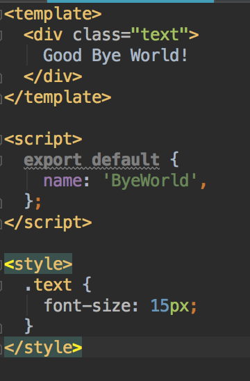
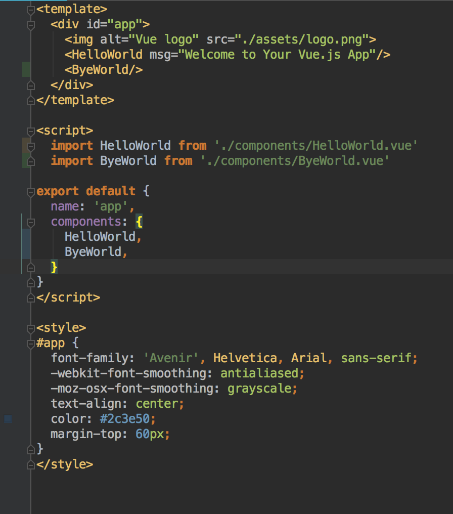

# 3-add-component

이제 컴포넌트에 대한 감이 어느정도 잡혔습니다.

프로젝트에 컴포넌트를 추가해보며, 조금 더 이해하도록 합시다.

먼저 src/components 폴더내에 ByeWorld.vue를 생성합니다.

그리고 내용을 작성하도록 합니다.

먼저 템플릿부터 작성하겠습니다만, App.vue에서 보이는 구조처럼

템플릿, 스크립트, 스타일 순서로 코드를 작성하면 됩니다.

```markup
<template>
  <div class="text">
    Good Bye World!
  </div>
</template>
```

딱히 기능이 없는, div태그 하나뿐인 컴포넌트입니다.

이제 바로 아래에 작성할 자바스크립트는

```markup
<script>
 <!--여기에 스크립트 작성-->
</script>
```

이런식으로 스크립트 태그안에 작성해주세요.

vue/cli로 프로젝트를 생성하고 기본 소스코드를 보면

세미콜론이 생략되어있는것을 볼수있는데, 저는 세미콜론을 사용하는것을 선호합니다.

취향이므로 적절히 생략해주세요.

같은 맥락\(?\)으로 객체 마지막 프로퍼티뒤에 콜론붙이는걸 좋아합니다. \(배열제외\)

```javascript
export default {
  name: 'ByeWorld', //이름은 컴포넌트파일의 이름과 같게해주세요
};
```

마지막으로 스타일은 이렇게 작성해주세요

마찬가지로 style태그로 꼭 묶어주세요

```markup
<style>
 <!--여기에 스타일 작성-->
</style>
```

```css
.text {
  font-size: 15px;
}
```

모두 작성하셨다면 아래 그림과 같은 소스코드형태가 됩니다.



정말 간단한 싱글파일컴포넌트를 작성해보았습니다.

만들기만했으므로, 웹에는 보이지않습니다.

이제 작성한 컴포넌트가 웹에 보여질수있도록 import 해봅시다.

src/App.vue 를 열어주세요.

먼저 스크립트 부분에

```javascript
import ByeWorld from './components/ByeWorld.vue'
```

이 코드를 추가해주시구요.

import한 ByeWorld컴포넌트를 components에도 추가해줍니다.

그리고 상단의 템플릿에서도 ByeWorld를 추가해줍니다.

설명대로 진행하셨다면, 소스코드는 아래그림처럼 됩니다.



소스를 저장하시고 웹을 확인해보시면, 페이지 하단에 Good Bye World! 문구가 추가된걸 볼 수 있습니다.

