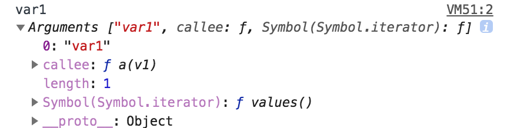

# arguments

함수에는 보이지않지만 argumnets라는 객체가 있습니다.

```javascript
function a(v1){
  console.log(v1, arguments);
}

a('var1');
```

## 결과



신기하게도 arguments라는 변수가 없는데,

콘솔에 잘 나오죠?

게다가 파라미터 변수에 대한 정보도 있고,

callee라는 함수도 보이네요.

자기 자신의 함수죠.

그 말은 arguments.callee 를 사용하면

자기자신의 함수를 호출할 수 있겠네요.

익명함수에서도 재귀함수를 구현할수있겠죠.

